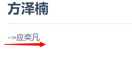
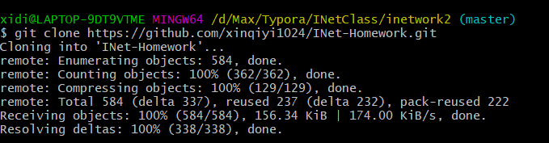
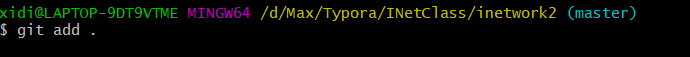
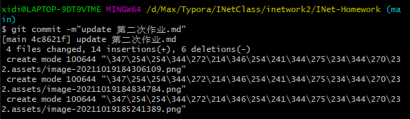
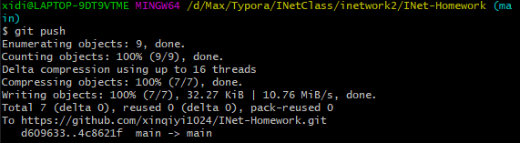
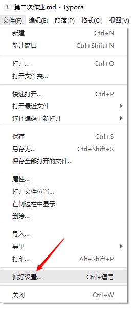
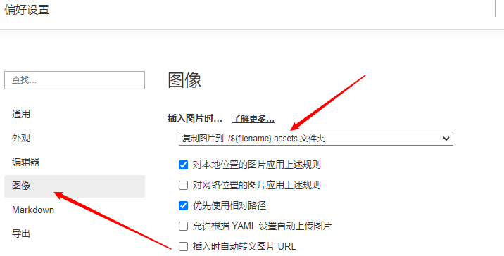

# 第二次作业

> 操作： 1.`git clone [url]`
>
> 克隆到本地后在`自己的师傅`名下添加自己的名字
> 
>`只交push截图`
>
> 如：
> 
> 
>
> ​				2.`git add .`
>
> ​				3.`git commit -m "消息内容" `
>
> ​				4.`git push`

> 截图：
> 
> 
>
> 
>
> 
>
> 

> 注意点：1.
> 
> 

## 戴任浩

## 赵昌朗

## 厉卓翰

## 陈乃垚

## 方泽楠

## 何哲远

## 林圣迪

## 汪星辰

————陈南星
———陈南星

## 章旭威
